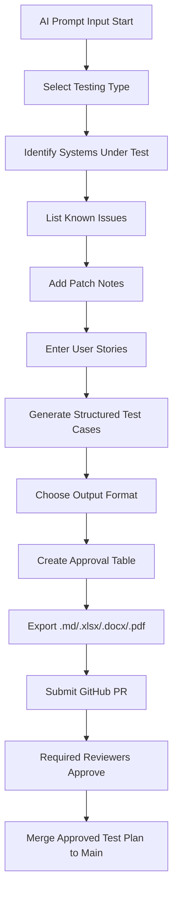

# 🤖 AI-Powered QA Test Plan Generator with GitHub Workflow Integration


---

## 📚 Table of Contents

* [📚 Table of Contents](#-table-of-contents)
* [🚀 What This Prompt Does](#-what-this-prompt-does)
* [🛠️ Setup & Folder Structure](#️-setup--folder-structure)
* [🔐 GitHub Branch Protection & Reviewer Workflow](#-github-branch-protection--reviewer-workflow)
* [📋 Supported Output Formats](#-supported-output-formats)
* [📊 QA Use Cases](#-qa-use-cases)
* [🧠 Prompt Engineering Logic](#-prompt-engineering-logic)
* [📈 Mermaid Workflow Diagram](#-mermaid-workflow-diagram)
* [📎 Contribution Guidelines](#-contribution-guidelines)
* [📄 License](#-license)

---

## 🚀 What This Prompt Does

This AI-powered prompt generates a fully structured QA test document, export-ready for:

* 📘 Markdown (.md) for GitHub
* 📄 Microsoft Word (.docx)
* 📊 Excel / CSV (.xlsx) — Jira-Compatible
* 🧪 ServiceNow Test Format
* 🛠️ TestRail JSON

It simulates enterprise-level QA workflows including:

* Test plan definition (UAT, API, regression, smoke...)
* System mapping (POS, D365, APIs, mobile, legacy...)
* Known issues and patch history
* User story generation
* Structured test cases (positive, negative, edge, API)
* Signature block for PM, QA Lead, IT Director, SVP
* Custom format outputs

---

## 🛠️ Setup & Folder Structure

In your local project root or GitHub repo, create:

```bash
C:\Users\Veteran\Documents\GitHub\cyoa-test-repo
```

Inside your repo:

```bash
mkdir -p qa-docs/versions/v1.0.0
```

Drop your outputs into that folder:

```
qa-docs/
└── versions/
    └── v1.0.0/
        ├── qa-test-plan.md
        ├── qa-test-plan.xlsx
        └── qa-test-plan.pdf
```

---

## 🔐 GitHub Branch Protection & Reviewer Workflow

To enforce a QA approval workflow in GitHub:

1. **Go to:** `Settings > Branches > Branch Protection Rules`

2. **Create rule for:** `main` or `release/*`

3. Check:

   * ✅ Require pull request before merging
   * ✅ Require approvals (set min reviewers: 2–4)
   * ✅ Dismiss stale reviews if new commits are pushed
   * ✅ Require status checks (if integrated with CI)

4. Assign default reviewers:

   * `QA Lead`
   * `Project Manager`
   * `IT Director`
   * `Executive Reviewer`

5. Submit PR when a QA document changes.

---

## 📋 Supported Output Formats

| Format        | Description                         |
| ------------- | ----------------------------------- |
| Markdown      | Clean doc with sections + approvals |
| Excel / CSV   | Jira-style test table importable    |
| Word (.docx)  | Polished document for stakeholders  |
| PDF           | Exportable record with signature    |
| TestRail JSON | JSON-ready import for test managers |

---

## 📊 QA Use Cases

* Microsoft D365 UAT test plan
* POS system regression suite
* REST API smoke & load tests
* Mobile app exploratory logs
* Jira- or ServiceNow-logged QA cycles

---

## 🧠 Prompt Engineering Logic

The prompt walks through:

1. Strategy selection
2. System identification
3. Pain points
4. Patch notes
5. User stories (up to 5)
6. Auto-generated test cases
7. Approver sign-off roles
8. Format selection
9. Export with version tagging

---

## 📈 Mermaid Workflow Diagram



---

## 📎 Contribution Guidelines

* Fork this repo
* Clone locally and create a new branch
* Add your prompt enhancements or test documents
* Push and submit a pull request
* Request review from @emcdo411 or team

---

## 📄 License

Here’s your updated `README.md` **License** section rewritten to reflect the DACR license professionally and with clarity. You can replace the current section in your `README.md` with this:

---

## 📜 License

This project is licensed under the **[DACR License v1.0](https://github.com/defensive-ai/dacr-license)** (Defensive AI Commercial Rights).
It is intended to promote **ethical use of AI systems** while prohibiting:

* Development or deployment of **autonomous weapons**
* **Surveillance or profiling** of individuals based on protected characteristics
* Use in projects that violate **labor, civil, or environmental rights**

> 🛡️ You may **use, modify, and distribute** this project **for commercial or non-commercial purposes**, as long as these ethical boundaries are respected.

### 📘 DACR TL;DR

> ✅ Commercial Use
> ✅ Research & Learning
> ❌ No Autonomous Weapons
> ❌ No Exploitative Surveillance
> ❌ No Use That Violates Human Rights

---


For full license details, visit [defensive-ai/dacr-license](https://github.com/defensive-ai/dacr-license).

---

Would you like me to create the actual `LICENSE` file next for you to commit to the repo?

---
